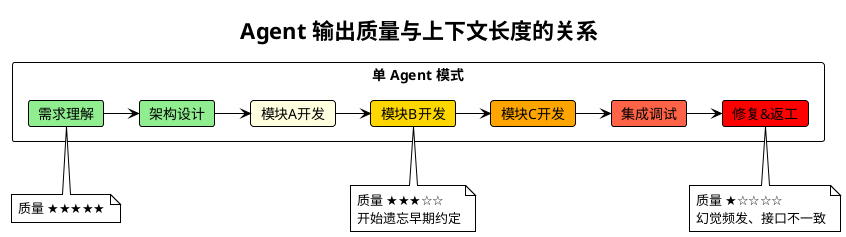
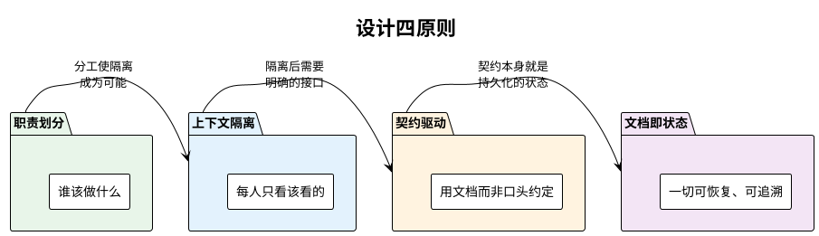
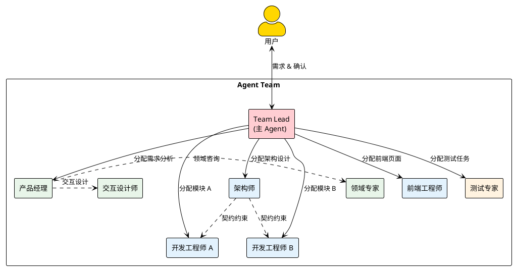
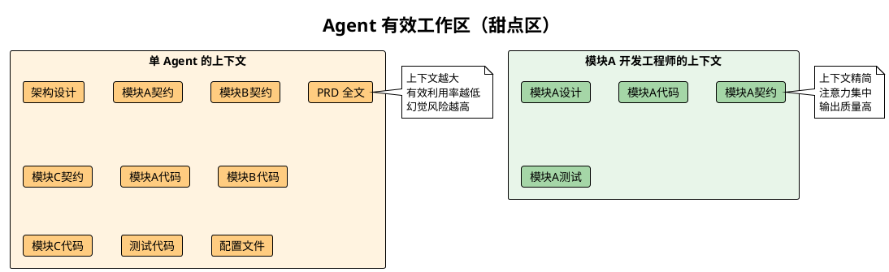
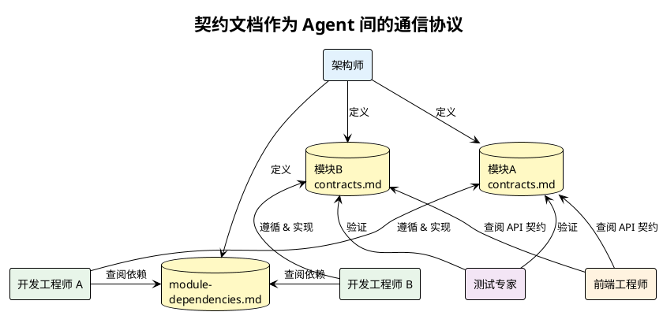
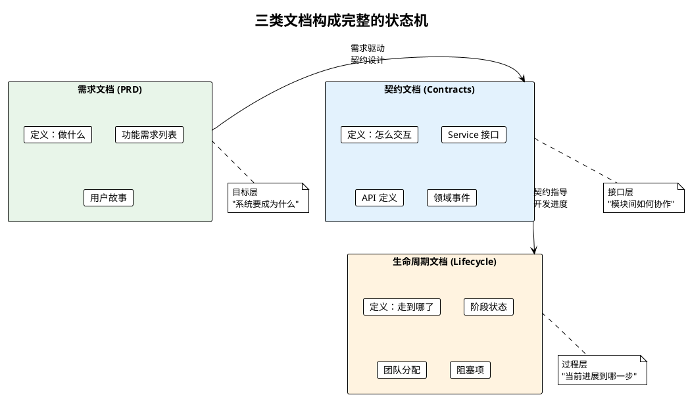
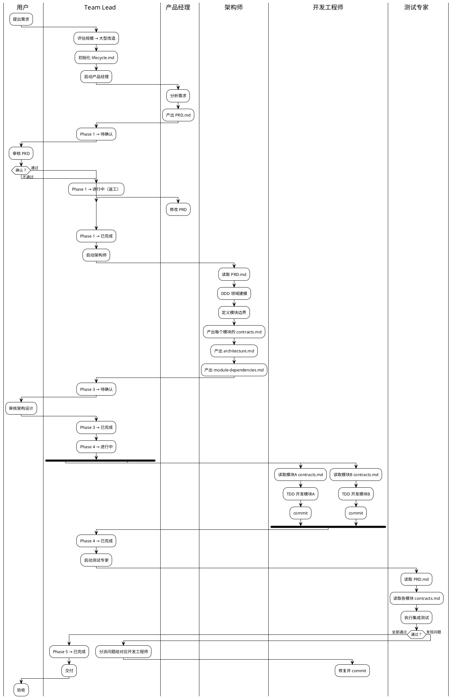
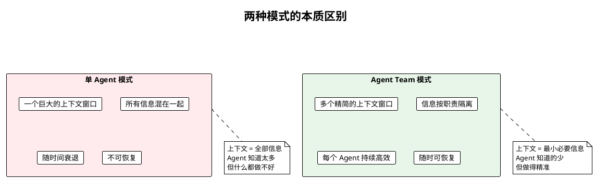
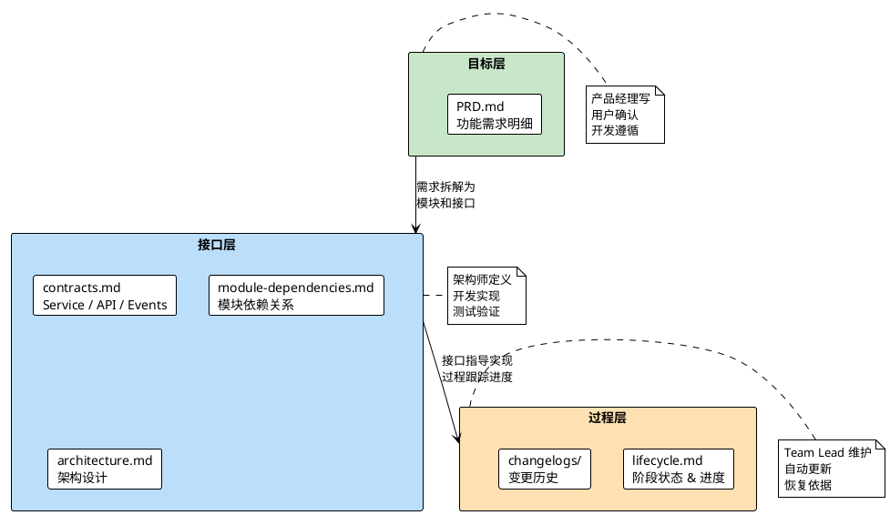

# 让 AI Agent 像真正的团队一样工作

## 一个现实问题

当你把一个大型需求交给单个 AI Agent，最初的输出往往令人惊艳。但随着对话轮次增加、上下文膨胀，你会观察到一个不可逆的衰退曲线：

**幻觉增多** — Agent 开始"发明"前面并不存在的接口定义。**信息丢失** — 早期确定的业务规则被后续的海量代码淹没。**风格漂移** — 同一个项目中出现截然不同的代码风格和架构模式。

这不是模型能力的问题，而是**使用方式**的问题。

---

## 核心理念：让每个 Agent 都在自己的甜点区工作

解决方案的灵感来自人类工程团队的组织方式——没有人能同时是产品经理、架构师、开发者和测试工程师。人类团队通过**分工**和**契约**来协作，AI Agent 团队同样应该如此。

### 原则一：职责划分 — 让专业的 Agent 做专业的事

一个 Agent 不应该同时思考"用户想要什么"和"数据库表怎么建"。人类团队中产品经理不写代码、开发工程师不做产品决策，AI Agent 同样需要明确的角色边界。

每个 Agent 拥有**精确定义的职责边界**：

| 角色 | 关注点 | 不关心什么 |
|------|--------|-----------|
| 产品经理 | 用户需要什么，功能如何定义 | 代码怎么写，数据库怎么设计 |
| 架构师 | 模块怎么拆，接口怎么定义 | 具体的业务逻辑实现 |
| 开发工程师 | 自己负责的模块如何实现 | 其他模块的内部实现 |
| 测试专家 | 系统整体是否符合 PRD | 具体的代码实现细节 |
| Team Lead | 流程推进、任务分配、阻塞协调 | 任何具体的技术实现 |

这种划分的意义在于：**每个 Agent 的上下文中只需要加载与其职责相关的信息**。产品经理不需要读代码，开发工程师不需要读 PRD 全文——他只需要看到自己模块的契约文档。

### 原则二：上下文隔离 — 甜点区是有限的

大语言模型存在一个隐性的**有效上下文窗口**。虽然上下文长度可以很大，但信息密度越高、跨度越大，模型的注意力就越分散。这就像一个人同时处理 10 件不相关的事——即使记忆力再好，也会顾此失彼。

我们的策略是**通过分工来实现上下文隔离**：

- **开发工程师**只加载自己模块的契约、设计和代码
- **架构师**只关注模块间的依赖和接口定义，不看实现
- **产品经理**只处理需求和功能定义，不接触技术文档
- **Team Lead**只跟踪生命周期文件和任务状态，不深入任何模块

每个 Agent 都工作在**最小必要上下文**中，这就是它的甜点区。

### 原则三：契约驱动 — 文档是 Agent 之间唯一的语言

人类团队可以在走廊里碰面聊两句来对齐信息。Agent 没有走廊。Agent 之间的一切协作必须通过**持久化的、结构化的文档**来完成。

每个模块的 `contracts.md` 包含三类契约：

- **Service 接口** — 暴露给其他模块的同步调用
- **Controller 接口** — 暴露给前端的 HTTP API
- **Events** — 模块发出的领域事件

这些契约是**唯一的事实来源**。开发工程师实现时以契约为准，测试工程师验证时以契约为据，前端工程师联调时以契约为参考。没有任何信息需要通过"记住对话内容"来传递。

**契约变更**也有严格的流程——发起方必须通知 Team Lead，Team Lead 协调所有依赖方确认后，才能修改契约文档。这保证了多个 Agent 并行工作时的一致性。

### 原则四：文档即状态 — 随时可恢复、随时可介入

AI Agent 的会话是易失的。一次网络中断、一次上下文截断，之前的所有进度就可能丢失。我们的方案是：**把所有状态外化到文档中**。

三类文档各司其职：

| 文档类型 | 回答的问题 | 特性 |
|----------|-----------|------|
| **需求文档** (PRD) | 我们要做什么？ | 保持最新状态，反映当前需求全景 |
| **契约文档** (Contracts) | 模块之间如何交互？ | 保持最新状态，是实现的唯一依据 |
| **生命周期文档** (Lifecycle) | 当前走到哪了？ | 实时更新，是恢复进度的唯一入口 |

当一个新的 Agent 会话启动时（无论是因为中断恢复还是新 Agent 加入），它只需要：

1. 读取 `lifecycle.md` — 知道当前在哪个阶段
2. 读取自己相关的 `contracts.md` — 知道接口约束
3. 开始工作

不需要回溯整个对话历史，不需要重新理解全局架构，不需要阅读其他模块的代码。**最快的速度、最小的上下文、最精确的信息**。

---

## 完整流程：以一次大型改造为例

注意这个流程中的几个关键设计：

**1. 人工确认网关**

流程中设置了多个"门禁"。PRD 必须用户确认才能开始设计，架构设计必须用户确认才能开始开发。这不是对 AI 能力的不信任，而是对**方向正确性**的保障——修正方向的成本远低于推倒重来。

**2. 开发工程师的上下文**

开发工程师 A 和 B 是完全并行的。A 只读模块 A 的 `contracts.md`，B 只读模块 B 的 `contracts.md`。他们互不干扰、互不依赖，各自在最小上下文中高效工作。

**3. 状态持久化**

每个阶段转换都会更新 `lifecycle.md`。如果在 Phase 4 中途会话中断，新会话的 Team Lead 读取 `lifecycle.md` 就能精确恢复——哪些模块已完成、哪些正在进行、有什么阻塞项。

---

## 为什么不直接给一个 Agent 塞完所有东西？

| | 单 Agent | Agent Team |
|--|----------|-----------|
| 上下文大小 | 持续膨胀 | 恒定精简 |
| 输出质量 | 随上下文衰退 | 保持稳定 |
| 信息一致性 | 依赖模型记忆 | 依赖持久化文档 |
| 中断恢复 | 几乎不可能 | 读取文档即恢复 |
| 并行能力 | 无 | 天然支持 |
| 适用规模 | 小型任务 | 任意规模 |

---

## 文档体系的分层设计

整个文档体系被刻意设计为三个层次，每一层服务于不同的目的：

这个分层背后的思考是：

- **目标层**回答"为什么做"和"做什么" — 即使更换全部开发 Agent，只要 PRD 在，需求就不会丢失
- **接口层**回答"怎么交互" — 即使某个 Agent 中途崩溃，新 Agent 读完契约就能接手
- **过程层**回答"走到哪了" — 即使整个会话丢失，生命周期文件记录了精确的进度快照

每一层都是独立可恢复的，组合在一起就构成了一个**对 Agent 会话中断具有弹性的系统**。

---

## 小结

这套配置的设计并非追求复杂——恰恰相反，它追求的是让每个 Agent 的工作尽可能**简单**。

> 一个 Agent 做好一件事，胜过一个 Agent 做完所有事。

核心策略只有三条：

1. **分工** — 让每个 Agent 的上下文保持在甜点区
2. **契约** — 用文档替代记忆，用结构替代约定
3. **持久化** — 一切状态写入文件，任何时刻可恢复

当每个 Agent 都只需要处理它能处理好的那部分工作时，整个团队的输出质量就不再受限于上下文窗口的大小，而是取决于架构设计的合理性——就像真正的人类工程团队一样。
