# 让 AI Agent 像真正的团队一样工作

## 一个现实问题

当你把一个大型需求交给单个 AI Agent，最初的输出往往令人惊艳。但随着对话轮次增加、上下文膨胀，你会观察到一个不可逆的衰退曲线：

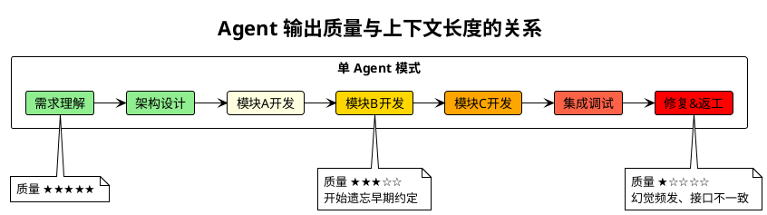

**幻觉增多** — Agent 开始"发明"前面并不存在的接口定义。**信息丢失** — 早期确定的业务规则被后续的海量代码淹没。**风格漂移** — 同一个项目中出现截然不同的代码风格和架构模式。

这不是模型能力的问题，而是**使用方式**的问题。

---

## 核心理念：让每个 Agent 都在自己的甜点区工作

解决方案的灵感来自人类工程团队的组织方式——没有人能同时是产品经理、架构师、开发者和测试工程师。人类团队通过**分工**和**契约**来协作，AI Agent 团队同样应该如此。

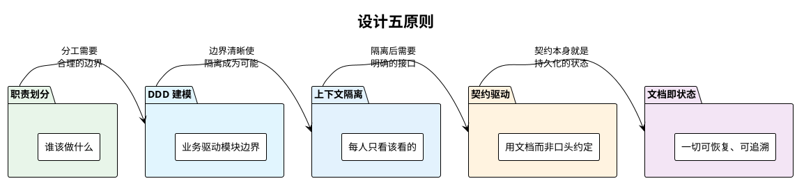

### 原则一：职责划分 — 让专业的 Agent 做专业的事

一个 Agent 不应该同时思考"用户想要什么"和"数据库表怎么建"。人类团队中产品经理不写代码、开发工程师不做产品决策，AI Agent 同样需要明确的角色边界。

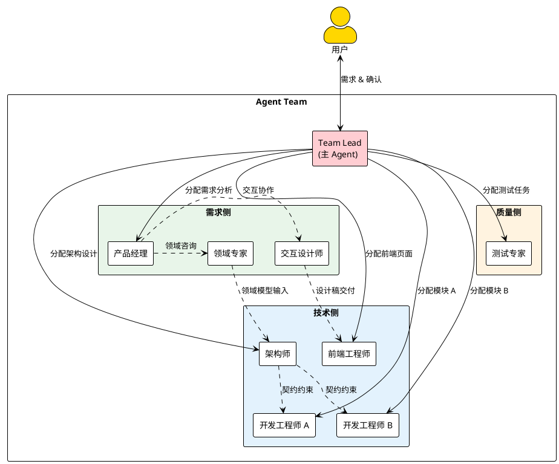

每个 Agent 拥有**精确定义的职责边界**：

| 角色 | 关注点 | 不关心什么 |
|------|--------|-----------|
| 产品经理 | 用户需要什么，功能如何定义 | 代码怎么写，数据库怎么设计 |
| 领域专家 | 业务规则、行业术语、领域模型是否合理 | 技术实现方式、代码结构 |
| 交互设计师 | 用户体验、页面布局、交互流程 | 后端实现、数据模型 |
| 架构师 | 模块怎么拆，接口怎么定义，领域边界在哪 | 具体的业务逻辑实现 |
| 开发工程师 | 自己负责的模块如何实现 | 其他模块的内部实现 |
| 测试专家 | 系统整体是否符合 PRD | 具体的代码实现细节 |
| Team Lead | 流程推进、任务分配、阻塞协调 | 任何具体的技术实现 |

**领域专家**和**交互设计师**是两个容易被忽视却极其关键的角色：

**领域专家**是业务知识的守护者。当产品经理梳理需求时，领域专家确保需求描述使用了正确的业务术语，功能划分符合真实的业务流程。当架构师进行 DDD 建模时，领域专家校验领域模型是否准确反映了业务本质——一个"订单"应该包含哪些属性、"支付"和"结算"是不是同一个概念、哪些业务操作必须在同一个事务中完成。没有领域专家，Agent 很容易用技术思维去硬拆业务，产出看似合理但脱离实际的模型。

**交互设计师**是需求到实现之间的翻译者。PRD 描述的是"做什么"，但不包含"看起来是什么样"。交互设计师基于 PRD 产出可运行的 HTML/CSS 交互原型，让用户在开发开始前就能直观感受产品形态。更重要的是，交互原型为前端开发工程师提供了明确的实现目标——不是猜测产品经理的意图，而是照着已确认的设计稿精确复原。

这种划分的意义在于：**每个 Agent 的上下文中只需要加载与其职责相关的信息**。产品经理不需要读代码，开发工程师不需要读 PRD 全文——他只需要看到自己模块的契约文档和设计稿。

### 原则二：DDD 建模 — 让业务语义驱动模块边界

职责划分解决了"谁做什么"的问题，但还有一个更根本的问题：**模块怎么拆？**

拆模块是架构设计的核心决策，拆得好，每个开发 Agent 的工作独立、完整、可验证；拆得不好，模块间纠缠不清，一个改动牵动全局。

我们选择**领域驱动设计（DDD）**作为模块拆分的方法论。DDD 的核心思想是：**模块边界应该由业务语义决定，而不是由技术层次决定**。

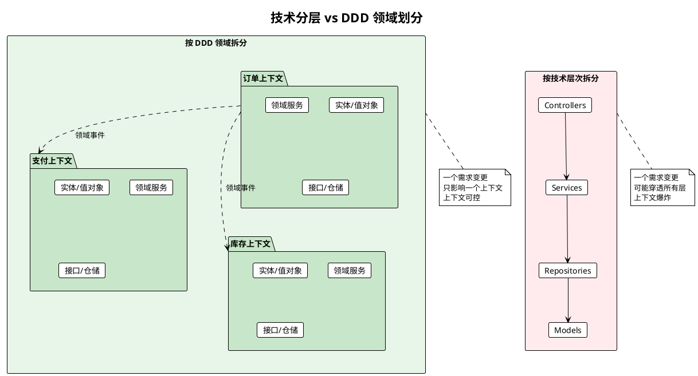

DDD 给 Agent 团队带来了三个关键优势：

**1. 限界上下文 = Agent 的工作边界**

DDD 中的限界上下文（Bounded Context）天然地定义了一个开发 Agent 的工作范围。"订单上下文"中的所有概念——订单、订单项、订单状态——都由同一个 Agent 负责。这个 Agent 不需要理解"支付"或"库存"是怎么工作的，它只需要知道：当订单创建时，发出一个 `OrderCreated` 事件。

**2. 领域事件 = 模块间的解耦机制**

DDD 推崇用领域事件（Domain Events）来解耦上下文之间的通信。订单不直接调用库存的扣减接口，而是发布 `OrderCreated` 事件，库存模块自行订阅并处理。对 Agent 来说，这意味着模块间不存在运行时的紧耦合——开发订单模块的 Agent 完全不需要加载库存模块的代码。

**3. 统一语言 = Agent 的共识基础**

DDD 强调"统一语言"（Ubiquitous Language），即团队成员对业务概念的表述必须一致。在 Agent 团队中，这通过**领域专家**的参与来保障。领域专家审核领域模型中的术语——确保 "Recipe"（配方）和 "Dish"（菜品）的区别在所有模块中保持一致，而不是一个 Agent 叫 "Recipe"、另一个 Agent 叫 "Menu Item"。

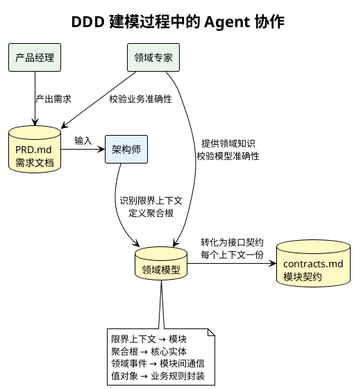

这就是为什么架构师不是凭技术直觉拍脑袋拆模块，而是与领域专家一起，从业务语义出发，识别出**天然的边界**。这些边界不会因为技术重构而改变——因为它们反映的是业务本身的结构。

### 原则三：上下文隔离 — 甜点区是有限的

大语言模型存在一个隐性的**有效上下文窗口**。虽然上下文长度可以很大，但信息密度越高、跨度越大，模型的注意力就越分散。这就像一个人同时处理 10 件不相关的事——即使记忆力再好，也会顾此失彼。

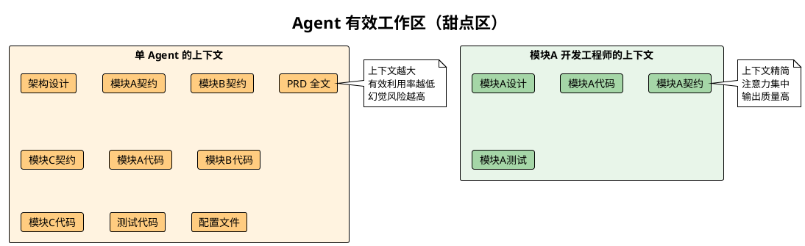

我们的策略是**通过分工来实现上下文隔离**：

- **领域专家**只关注业务知识和领域模型，不看技术实现
- **交互设计师**只处理页面和交互逻辑，不关心后端架构
- **开发工程师**只加载自己模块的契约、设计和代码
- **架构师**只关注模块间的依赖和接口定义，不看实现
- **产品经理**只处理需求和功能定义，不接触技术文档
- **Team Lead**只跟踪生命周期文件和任务状态，不深入任何模块

每个 Agent 都工作在**最小必要上下文**中，这就是它的甜点区。

### 原则四：契约驱动 — 文档是 Agent 之间唯一的语言

人类团队可以在走廊里碰面聊两句来对齐信息。Agent 没有走廊。Agent 之间的一切协作必须通过**持久化的、结构化的文档**来完成。

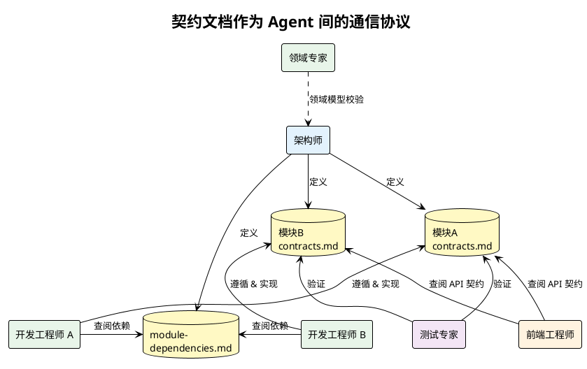

每个模块的 `contracts.md` 包含三类契约：

- **Service 接口** — 暴露给其他模块的同步调用
- **Controller 接口** — 暴露给前端的 HTTP API
- **Events** — 模块发出的领域事件

这些契约是**唯一的事实来源**。开发工程师实现时以契约为准，测试工程师验证时以契约为据，前端工程师联调时以契约为参考。没有任何信息需要通过"记住对话内容"来传递。

**契约变更**也有严格的流程——发起方必须通知 Team Lead，Team Lead 协调所有依赖方确认后，才能修改契约文档。这保证了多个 Agent 并行工作时的一致性。

### 原则五：文档即状态 — 随时可恢复、随时可介入

AI Agent 的会话是易失的。一次网络中断、一次上下文截断，之前的所有进度就可能丢失。我们的方案是：**把所有状态外化到文档中**。

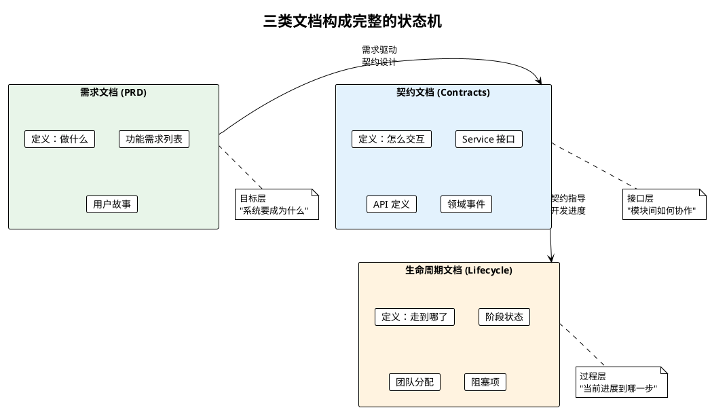

三类文档各司其职：

| 文档类型 | 回答的问题 | 特性 |
|----------|-----------|------|
| **需求文档** (PRD) | 我们要做什么？ | 保持最新状态，反映当前需求全景 |
| **契约文档** (Contracts) | 模块之间如何交互？ | 保持最新状态，是实现的唯一依据 |
| **生命周期文档** (Lifecycle) | 当前走到哪了？ | 实时更新，是恢复进度的唯一入口 |

当一个新的 Agent 会话启动时（无论是因为中断恢复还是新 Agent 加入），它只需要：

1. 读取 `lifecycle.md` — 知道当前在哪个阶段
2. 读取自己相关的 `contracts.md` — 知道接口约束
3. 开始工作

不需要回溯整个对话历史，不需要重新理解全局架构，不需要阅读其他模块的代码。**最快的速度、最小的上下文、最精确的信息**。

---

## TDD：让 Agent 开发做到 One Shot

原则解决了"怎么分工"和"怎么协作"的问题，但还有一个实操层面的关键挑战：**如何让开发 Agent 一次就写对？**

单 Agent 模式下，开发过程往往是"写一段代码 → 跑一下 → 报错 → 改 → 再跑 → 又报错"的循环。每一轮试错都在消耗上下文空间，几轮下来，Agent 已经被错误信息和修复尝试淹没了。

我们的答案是**测试驱动开发（TDD）**——不是作为一种工程美学，而是作为一种**对 Agent 特别有效的开发策略**。

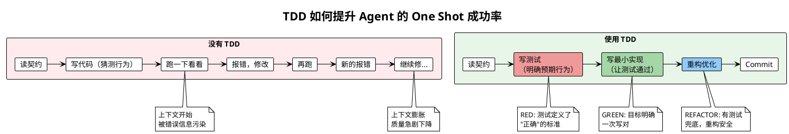

### 为什么 TDD 对 Agent 特别有效？

**1. 测试就是最精确的"需求规格"**

契约文档告诉 Agent "这个接口接收什么、返回什么"，但文档是自然语言，存在歧义空间。而测试用例是可执行的代码，它精确到每一个输入和每一个预期输出。当 Agent 先写测试时，它实际上是在把契约从自然语言翻译成了一份**无歧义的规格说明**。

**2. 测试把"大目标"分解为"小步骤"**

"实现订单模块"是一个模糊的大目标。但 TDD 要求你先写出：

- 测试 1：创建订单应返回订单 ID
- 测试 2：订单总金额应等于所有订单项金额之和
- 测试 3：取消已发货订单应抛出异常

每个测试都是一个独立的、可验证的小目标。Agent 每次只需要聚焦于让一个测试通过——这恰好是 Agent 最擅长的事。

**3. 即时反馈消灭试错循环**

测试通过或失败是二元的、即时的。Agent 不需要手动检查输出、猜测行为是否正确，测试框架会直接告诉它对或错。这意味着 Agent 的"写代码 → 验证"循环被压缩到最短，上下文几乎不会被错误信息污染。

**4. 重构有安全网**

TDD 的第三步是重构（REFACTOR）。有了完整的测试覆盖，Agent 可以大胆优化代码结构而不担心引入回归——测试会立即捕获任何破坏性改动。

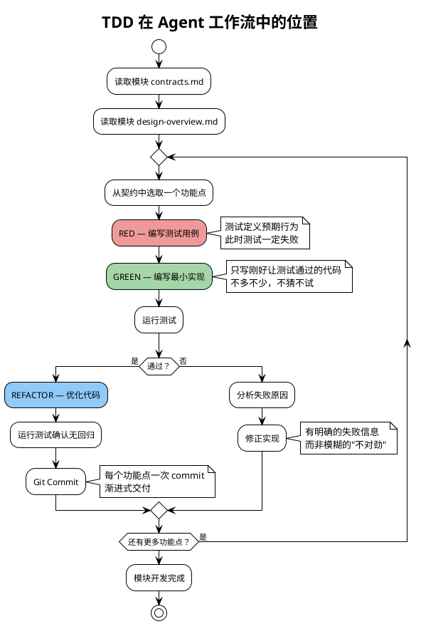

### TDD + 上下文隔离 = 最大化 One Shot 率

TDD 的价值在与上下文隔离结合时被放大到极致：

- **上下文隔离**确保了 Agent 进入开发时，脑中只有一个模块的契约和设计
- **TDD** 进一步把这个模块的开发拆解为一个个独立的小测试
- 每个测试都是一个**封闭的、目标明确的微任务**

这就像给 Agent 一份精确到步骤的施工图纸：不用全局思考，不用猜测上下文，只需要一个测试一个测试地通过。这是 Agent 最舒适的工作模式——**上下文小、目标明确、反馈即时**。

---

## 完整流程：以一次大型改造为例

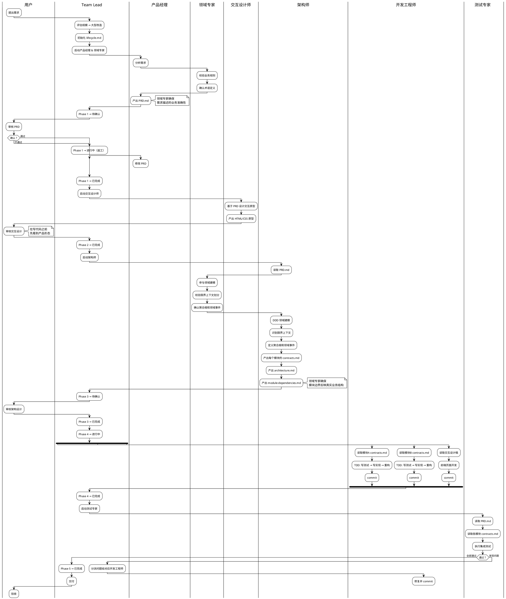

注意这个流程中的几个关键设计：

**1. 领域专家贯穿前三个阶段**

领域专家不是一个独立的阶段，而是一个**跨阶段的顾问角色**。在需求分析阶段，他帮产品经理确保业务逻辑的准确性；在架构设计阶段，他帮架构师验证 DDD 领域模型是否真实反映业务结构。大型改造中领域专家是必须角色——因为错误的业务理解导致的模块划分问题，代价远大于一个技术 Bug。

**2. 交互设计先于开发**

在开发 Agent 写出第一行代码之前，交互设计师已经产出了可运行的原型，并经用户确认。这意味着前端开发 Agent 拿到的不是模糊的文字描述，而是精确的视觉规格——又一个减少试错、提高 One Shot 率的设计。

**3. 人工确认网关**

流程中设置了多个"门禁"。PRD 必须用户确认才能开始设计，架构设计必须用户确认才能开始开发。这不是对 AI 能力的不信任，而是对**方向正确性**的保障——修正方向的成本远低于推倒重来。

**4. TDD 驱动的并行开发**

开发工程师 A 和 B 是完全并行的。A 只读模块 A 的 `contracts.md`，用 TDD 逐个功能点实现；B 同理。他们互不干扰、互不依赖，各自在最小上下文中用 RED-GREEN-REFACTOR 循环高效产出。

**5. 状态持久化**

每个阶段转换都会更新 `lifecycle.md`。如果在 Phase 4 中途会话中断，新会话的 Team Lead 读取 `lifecycle.md` 就能精确恢复——哪些模块已完成、哪些正在进行、有什么阻塞项。

---

## 为什么不直接给一个 Agent 塞完所有东西？

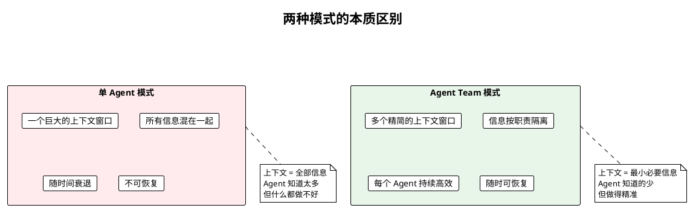

| | 单 Agent | Agent Team |
|--|----------|-----------|
| 上下文大小 | 持续膨胀 | 恒定精简 |
| 输出质量 | 随上下文衰退 | 保持稳定 |
| 信息一致性 | 依赖模型记忆 | 依赖持久化文档 |
| 模块划分 | 临时的、技术导向 | DDD 驱动、业务语义导向 |
| 开发效率 | 试错循环，多次返工 | TDD 驱动，One Shot 完成 |
| 中断恢复 | 几乎不可能 | 读取文档即恢复 |
| 并行能力 | 无 | 天然支持 |
| 适用规模 | 小型任务 | 任意规模 |

---

## 文档体系的分层设计

整个文档体系被刻意设计为三个层次，每一层服务于不同的目的：

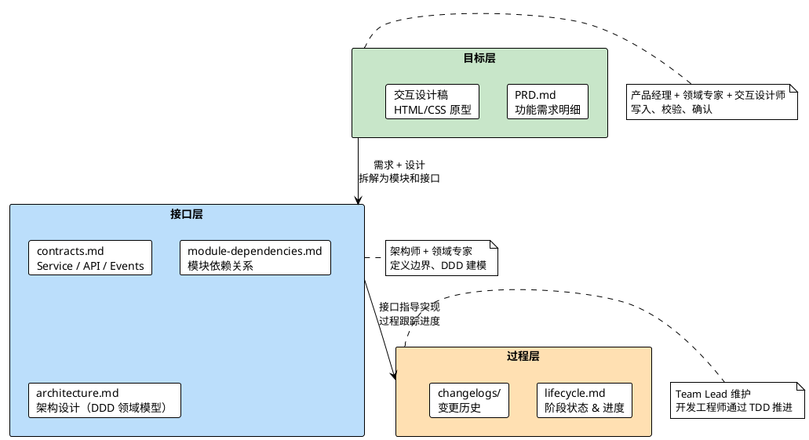

这个分层背后的思考是：

- **目标层**回答"为什么做"和"做什么" — 产品经理定义需求、领域专家校验准确性、交互设计师呈现形态。即使更换全部开发 Agent，只要目标层在，需求和设计就不会丢失
- **接口层**回答"怎么交互" — 架构师用 DDD 方法论从业务语义中提炼出模块边界和契约。即使某个 Agent 中途崩溃，新 Agent 读完契约就能接手
- **过程层**回答"走到哪了" — 即使整个会话丢失，生命周期文件记录了精确的进度快照

每一层都是独立可恢复的，组合在一起就构成了一个**对 Agent 会话中断具有弹性的系统**。

---

## 小结

这套配置的设计并非追求复杂——恰恰相反，它追求的是让每个 Agent 的工作尽可能**简单**。

> 一个 Agent 做好一件事，胜过一个 Agent 做完所有事。

核心策略：

1. **分工** — 7 个 Agent 各司其职，领域专家守护业务准确性，交互设计师让需求可视化
2. **DDD** — 用业务语义而非技术直觉驱动模块划分，让边界天然、稳固
3. **TDD** — RED-GREEN-REFACTOR 循环让开发 Agent 每次只聚焦一个小目标，最大化 One Shot 率
4. **契约** — 用文档替代记忆，用结构替代约定
5. **持久化** — 一切状态写入文件，任何时刻可恢复

当每个 Agent 都只需要处理它能处理好的那部分工作时，整个团队的输出质量就不再受限于上下文窗口的大小，而是取决于架构设计的合理性——就像真正的人类工程团队一样。
