# 让 AI Agent 像真正的团队一样工作

## 问题

把大型需求交给单个 AI Agent，随着上下文膨胀，输出质量会不可逆地衰退：

- **幻觉增多** — Agent 开始"发明"并不存在的接口
- **信息丢失** — 早期的业务规则被海量代码淹没
- **风格漂移** — 同一项目中出现截然不同的架构模式

这不是模型能力的问题，而是**使用方式**的问题。

---

## 核心理念：让每个 Agent 都在甜点区工作

人类团队通过**分工**和**契约**来协作，AI Agent 团队同样如此。

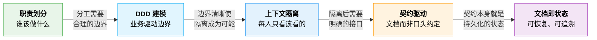

### 一、职责划分

一个 Agent 不应该同时思考"用户想要什么"和"数据库表怎么建"。

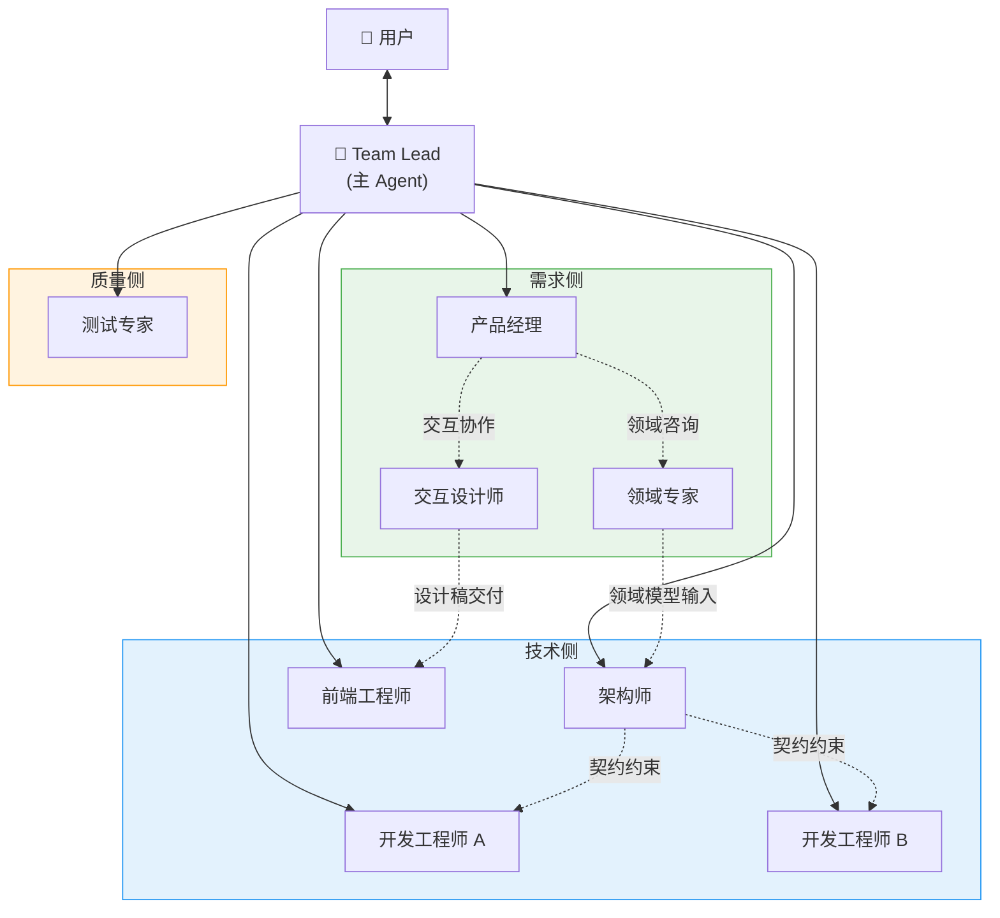

| 角色 | 关注什么 | 不关心什么 |
|------|---------|-----------|
| 产品经理 | 用户需求、功能定义 | 代码、数据库 |
| 领域专家 | 业务规则、术语、领域模型 | 技术实现 |
| 交互设计师 | 体验、布局、交互流程 | 后端实现 |
| 架构师 | 模块拆分、接口定义、领域边界 | 具体实现 |
| 开发工程师 | 自己模块的实现 | 其他模块内部 |
| 测试专家 | 系统是否符合 PRD | 代码细节 |
| Team Lead | 流程推进、任务分配 | 任何技术实现 |

### 二、DDD 建模 — 业务语义驱动模块边界

拆模块是架构的核心决策。我们用 **领域驱动设计（DDD）** 来拆分：**模块边界由业务语义决定，而非技术层次**。

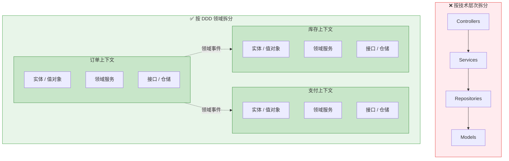

DDD 给 Agent 团队带来三个优势：

| DDD 概念 | 对 Agent 的意义 |
|----------|----------------|
| **限界上下文** | 天然定义了一个 Agent 的工作范围。Agent 不需要理解其他上下文，只需发出领域事件 |
| **领域事件** | 模块间通过事件解耦，开发 A 模块的 Agent 完全不需要加载 B 模块的代码 |
| **统一语言** | 通过领域专家确保所有模块对业务概念的命名一致，消除 Agent 间的"术语分歧" |

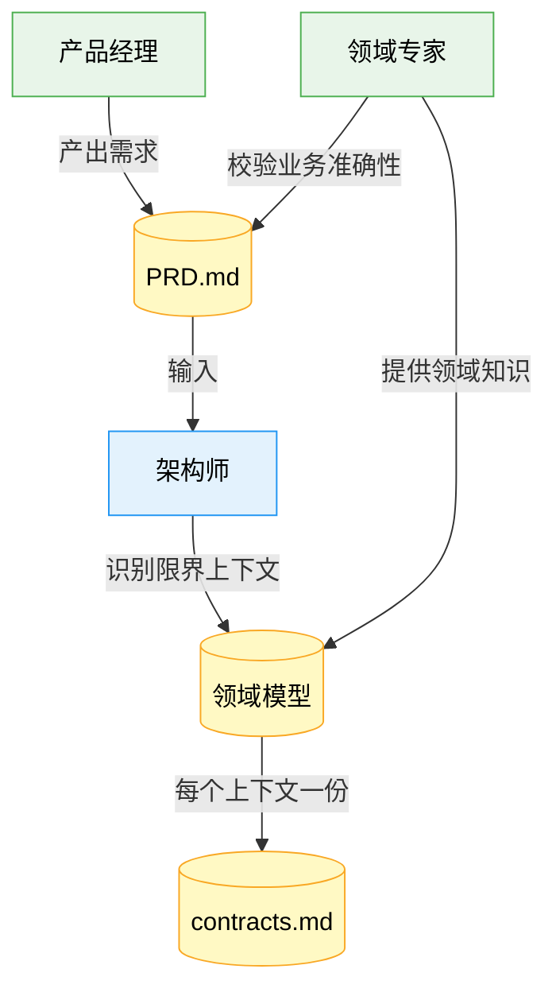

> 限界上下文 → 模块，聚合根 → 核心实体，领域事件 → 模块间通信，值对象 → 业务规则封装

架构师不是凭直觉拆模块，而是与领域专家一起从业务语义出发，识别**天然的边界**——这些边界不会因为技术重构而改变。

### 三、上下文隔离 — 甜点区是有限的

模型的上下文窗口虽大，但信息越多、跨度越大，注意力越分散。**通过分工实现隔离，让每个 Agent 工作在最小必要上下文中**。

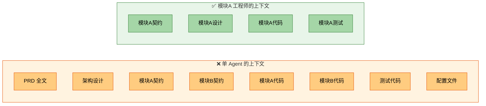

> 上下文越大，幻觉风险越高；上下文精简，输出质量越高。

### 四、契约驱动 — 文档是 Agent 之间唯一的语言

Agent 没有走廊可以碰面聊天。一切协作通过**持久化的契约文档**完成。

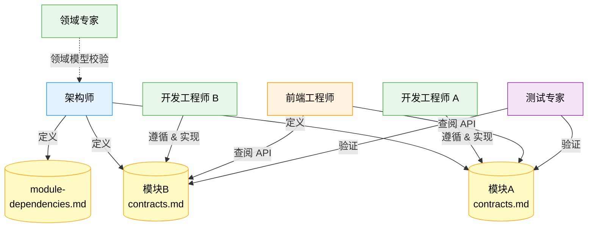

每个模块的 `contracts.md` 包含三类契约：**Service 接口**（模块间同步调用）、**Controller 接口**（前端 HTTP API）、**Events**（领域事件）。

契约是唯一的事实来源。实现以契约为准，测试以契约为据，联调以契约为参考。变更契约须通知 Team Lead 协调所有依赖方确认后才能修改。

### 五、文档即状态 — 随时可恢复

Agent 会话是易失的。我们把所有状态外化到三类文档中：

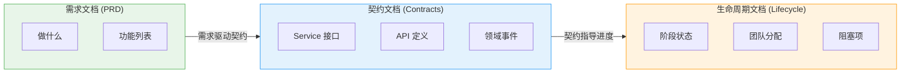

| 文档 | 回答什么 | 谁负责 |
|------|---------|--------|
| **PRD** | 做什么？ | 产品经理 + 领域专家 |
| **Contracts** | 怎么交互？ | 架构师 + 领域专家 |
| **Lifecycle** | 走到哪了？ | Team Lead |

新 Agent 加入时只需：读 `lifecycle.md` 知道阶段 → 读 `contracts.md` 知道约束 → 开始工作。不需要回溯对话历史。

### 六、TDD：目标 One Shot 开发

分工和契约解决了协作问题，但开发层面还有一个挑战：**如何让 Agent 一次写对？**

没有 TDD 时，开发是"写 → 跑 → 报错 → 改 → 再跑"的循环，每一轮试错都在消耗上下文。我们用**测试驱动开发（TDD）**来解决——不是作为工程美学，而是作为**对 Agent 特别有效的策略**。

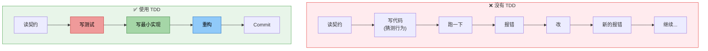

#### 为什么 TDD 对 Agent 特别有效？

1. **测试 = 无歧义的规格** — 契约是自然语言，有歧义；测试是可执行代码，精确到每个输入输出
2. **大目标变小步骤** — "实现订单模块"很模糊，但"创建订单应返回 ID"、"取消已发货订单应报错"都是可聚焦的微目标
3. **即时反馈** — 通过/失败是二元的，Agent 不需要猜测行为是否正确，上下文不会被试错信息污染
4. **安全重构** — 有完整测试覆盖，Agent 可以大胆优化而不担心回归

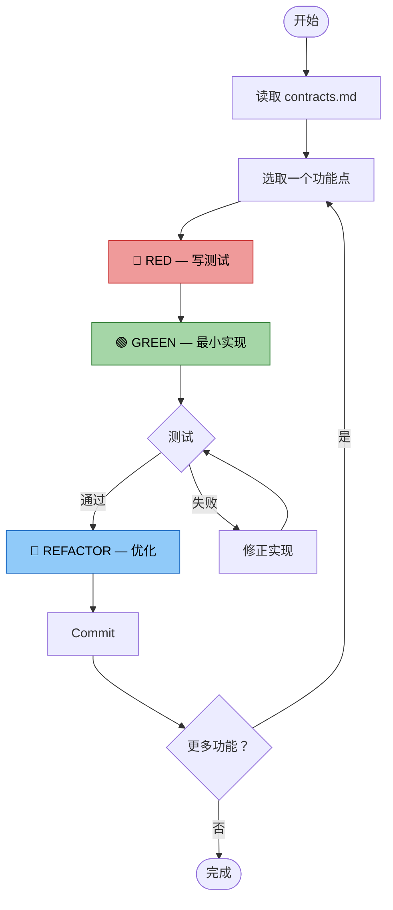

**TDD + 上下文隔离 = 最大化 One Shot 率**：隔离确保 Agent 脑中只有一个模块，TDD 再拆解为一个个小测试。每个测试都是封闭的微任务——上下文小、目标明确、反馈即时，这是 Agent 最舒适的工作模式。

---

## 完整流程

以一次大型改造为例：

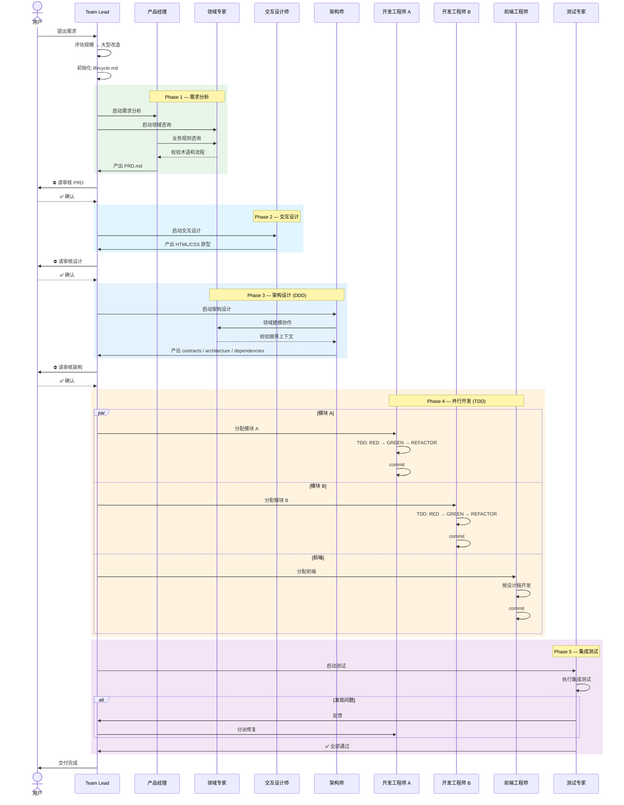

### 关键设计点

| 设计 | 目的 |
|------|------|
| **领域专家贯穿 Phase 1-3** | 跨阶段顾问，确保需求和架构的业务准确性 |
| **交互设计先于开发** | 前端拿到的是已确认的设计稿，而非模糊描述 |
| **人工确认网关** | 方向正确比速度更重要，修正方向的成本远低于推倒重来 |
| **TDD 并行开发** | 各工程师只读自己模块的 contracts.md，互不干扰 |
| **状态持久化** | 每个阶段转换更新 lifecycle.md，中断后可精确恢复 |

---

## 单 Agent vs Agent Team

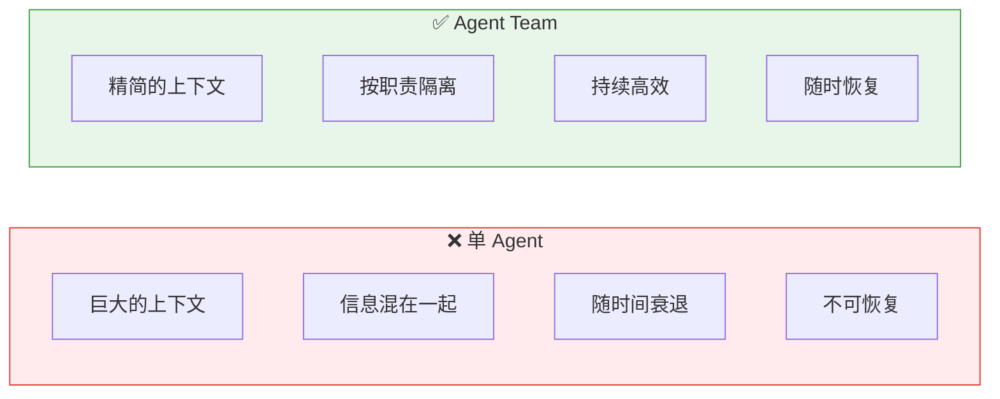

| | 单 Agent | Agent Team |
|--|----------|-----------|
| 上下文 | 持续膨胀 | 恒定精简 |
| 输出质量 | 随上下文衰退 | 保持稳定 |
| 一致性 | 依赖模型记忆 | 依赖持久化文档 |
| 模块划分 | 临时、技术导向 | DDD、业务语义导向 |
| 开发效率 | 试错循环 | TDD, One Shot |
| 中断恢复 | 几乎不可能 | 读文档即恢复 |
| 并行 | 无 | 天然支持 |

---

## 文档三层架构

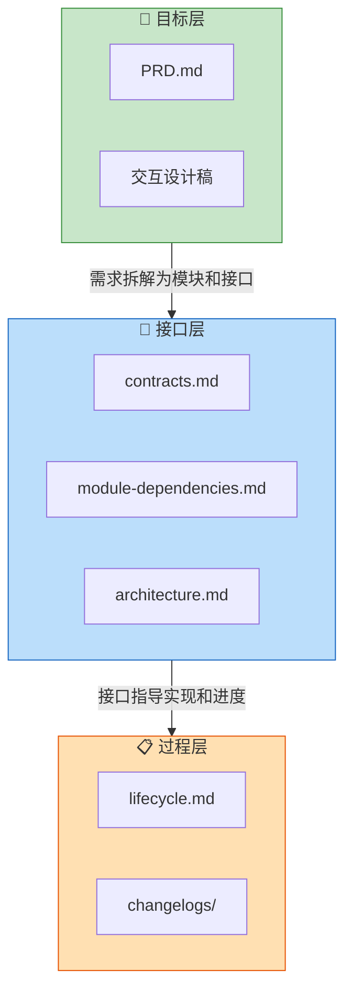

| 层 | 回答 | 负责人 | 容灾能力 |
|----|------|--------|---------|
| **目标层** | 为什么做、做什么 | PM + 领域专家 + 设计师 | 换掉所有开发 Agent，需求不丢 |
| **接口层** | 怎么交互 | 架构师 + 领域专家 | Agent 崩溃，读完契约即接手 |
| **过程层** | 走到哪了 | Team Lead | 会话丢失，读 lifecycle 即恢复 |

每一层独立可恢复，组合在一起构成**对 Agent 会话中断具有弹性的系统**。

---

## 小结

> 一个 Agent 做好一件事，胜过一个 Agent 做完所有事。

1. **分工** — 7 个 Agent 各司其职，每个都在甜点区工作
2. **DDD** — 业务语义驱动模块划分，边界天然稳固
3. **TDD** — RED-GREEN-REFACTOR 最大化 One Shot 率
4. **契约** — 用文档替代记忆，用结构替代约定
5. **持久化** — 一切状态写入文件，任何时刻可恢复

当每个 Agent 都只处理它能处理好的那部分工作时，团队输出质量不再受限于上下文窗口——就像真正的人类工程团队一样。
